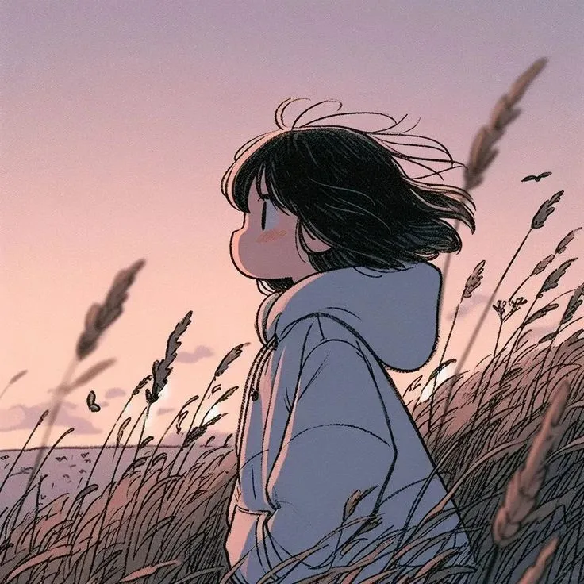
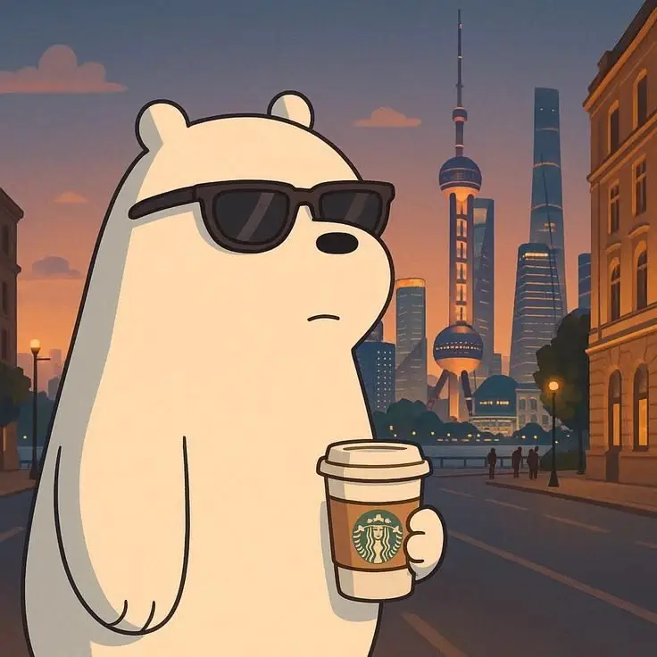

# تكليفات CSS الدروس من 30 إلى 33

## [ 4 ] تكليفات خاصة ب [ Position, List, Table ]

### التكليف 01

```html
<div class="green"></div>
<div class="red"></div>
<div class="blue"></div>
<div class="black"></div>
```

- إستخدم البنية السابقة بدون التعديل عليها لعمل نفس الشكل
- تأكد أنك تستعمل نفس الألوان الموجودة في الشكل
- تأكد ان عرض جميع العناصر وطولها هو 100px
- تأكد من ترتيب الطبقات فوق بعضها

```css
* {
  padding: 0;
  margin: 0;
  box-sizing: border-box;
}

:root {
  font-family: sans-serif;
  font-weight: 500;
  font-size: 20px;
}

div {
  width: 100px;
  height: 100px;
  position: absolute;
}

.green {
  background-color: #009688;
  top: 40px;
  left: 40px;
  z-index: 3;
}
.red {
  background-color: #f44336;
  top: 60px;
  left: 60px;
  z-index: 4;
}
.blue {
  background-color: #05a9f4;
  top: 20px;
  left: 20px;
  z-index: 2;
}
.black {
  background-color: #333333;
  top: 40px;
  left: 20px;
  z-index: 1;
}
```

### التكليف 02

```html
<div>
  Lorem, ipsum dolor sit amet consectetur adipisicing elit. Quod, sed. Ea ipsum similique quasi rem, fugiat voluptatibus reiciendis nam debitis earum quo veniam laudantium mollitia atque! Laborum ea nam doloribus.
  <span class="top-left">1</span>
  <span class="bottom-left">2</span>
  <span class="top-right">3</span>
  <span class="bottom-right">4</span>
</div>
```

- إستخدم البنية السابقة بدون التعديل عليها لعمل نفس الشكل
- عنصر ال div الرئيسي عرضه 400px
- قم بتوسيط عنصر ال div عرضيا في الشاشة
- تأكد أنك تستعمل نفس الالوان في جميع العناصر سواء كانت Background او Border أو أي شيء آخر

```css
* {
  padding: 0;
  margin: 0;
  box-sizing: border-box;
}

:root {
  font-family: sans-serif;
  font-weight: 500;
  font-size: 16px;
  --red: #f44336;
  --blue: #05a9f4;
  --green: #009688;
  --black: #333333;
  --white: #f4f4f4;
  --light-gray: #dbdbdb;
}

div {
  width: 400px;
  padding: 20px;
  margin: 30px auto;
  position: relative;
  line-height: 24px;
  text-align: center;
  background-color: var(--light-gray);
  border: 3px solid;
  border-color: var(--red) var(--blue) var(--red) var(--blue);
}

div span {
  padding: 5px 12px;
  position: absolute;
  background-color: var(--blue);
}

.top-left,
.top-right {
  top: -18px;
}
.bottom-left,
.bottom-right {
  bottom: -18px;
}
.top-left,
.bottom-left {
  left: -18px;
  border-right: 3px solid var(--red);
}
.top-right,
.bottom-right {
  right: -18px;
  border-left: 3px solid var(--red);
}
```

### التكليف 03

```html
<ul class="techs">
  <li class="tech html">
    HTML
    <ol class="lists html-lists" start="10">
      <li>Slim</li>
      <li>Pugjs</li>
      <li>HAML</li>
    </ol>
  </li>
  <li class="tech css">
    CSS
    <ol class="lists css-lists" type="I" start="10">
      <li>SASS</li>
      <li>LESS</li>
      <li>PostCSS</li>
    </ol>
  </li>
  <li class="tech js">
    JavaScript
    <ul class="lists js-lists">
      <li>Vuejs</li>
      <li>Sveltejs</li>
    </ul>
  </li>
</ul>
```

```css
* {
  padding: 0;
  margin: 0;
  box-sizing: border-box;
}

:root {
  font-family: sans-serif;
  font-weight: 500;
  font-size: 16px;
  --red: #f44336;
  --blue: #05a9f4;
  --green: #009688;
  --black: #333333;
  --white: #f4f4f4;
  --light-gray: #dbdbdb;
}

.techs {
  width: 400px;
  margin: 20px auto;
}

.tech {
  list-style: none;
  padding: 20px;
  padding-bottom: 10px;
  margin: 20px;
  background-color: var(--light-gray);
}

.lists {
  margin: 10px 0 0 40px;
}

.lists li {
  padding: 10px;
  margin-bottom: 10px;
  background-color: var(--white);
}

.js-lists {
  margin-left: 0px;
  padding-left: 25px;
  background-color: var(--white);
}
```

### التكليف 04

- قم بعمل الشكل التالي بإستخدام الجدول فقط ولا تضيف أي عناصر أخرى
- قم بتوسيط عنصر ال table عرضيا في الشاشة وتأكد أن عرضه هو 700px
- تأكد أنك تستعمل نفس الالوان في جميع العناصر سوا كانت Background أو Border

```html
<table class="devs-rating">
  <caption>
    Developers Rating
  </caption>
  <thead class="table-head">
    <tr>
      <th>Avatar</th>
      <th>Group</th>
      <th>Name</th>
      <th>Points</th>
      <th>Control</th>
    </tr>
  </thead>
  <tbody class="table-body">
    <tr>
      <td></td>
      <td>Ninja</td>
      <td>Nora Al-Ghail</td>
      <td>120</td>
      <td>
        <button class="view">View</button>
        <br />
        <br />
        <button class="delete">Delete</button>
      </td>
    </tr>
    <tr>
      <td></td>
      <td rowspan="2">Shades</td>
      <td>Sama Wildwood</td>
      <td>180</td>
      <td>
        <button class="view">View</button>
        <br />
        <br />
        <button class="delete">Delete</button>
      </td>
    </tr>
    <tr>
      <td></td>
      <td>Sultan Chill</td>
      <td>160</td>
      <td>
        <button class="view">View</button>
        <br />
        <br />
        <button class="delete">Delete</button>
      </td>
    </tr>
    <tr>
      <td></td>
      <td rowspan="2">Valhala</td>
      <td>Haneen Breeze</td>
      <td>190</td>
      <td>
        <button class="view">View</button>
        <br />
        <br />
        <button class="delete">Delete</button>
      </td>
    </tr>
    <tr>
      <td></td>
      <td>Zain Urban</td>
      <td>110</td>
      <td>
        <button class="view">View</button>
        <br />
        <br />
        <button class="delete">Delete</button>
      </td>
    </tr>
    <tr>
      <td></td>
      <td>Union</td>
      <td>Layla Dusk</td>
      <td>90</td>
      <td>
        <button class="view">View</button>
        <br />
        <br />
        <button class="delete">Delete</button>
      </td>
    </tr>
  </tbody>
</table>
```

```css
* {
  padding: 0;
  margin: 0;
  box-sizing: border-box;
}

:root {
  font-family: sans-serif;
  font-weight: 500;
  font-size: 16px;
  --red: #f44336;
  --blue: #05a9f4;
  --green: #009688;
  --black: #333333;
  --white: #f4f4f4;
  --light-gray: #dbdbdb;
}

.devs-rating {
  width: 700px;
  margin: 20px auto;
  text-align: center;
  border-collapse: collapse;
  border-bottom: 3px solid var(--green);
}

caption {
  margin-bottom: 20px;
  font-weight: 600;
}

th,
td {
  padding: 30px;
  background-color: var(--light-gray);
  border: 2px solid var(--white);
  vertical-align: middle;
}

th {
  padding: 20px;
  background-color: var(--black);
  color: var(--white);
}

.devs-rating .table-body .avatar {
  width: 75px;
  box-shadow: 0 0 5px var(--black);
  border: 3px solid var(--white);
}

button {
  border: 0;
  width: 55px;
  height: 25px;
  color: var(--white);
  font-weight: bold;
}

.view {
  background-color: var(--blue);
}

.delete {
  background-color: var(--red);
}
```
